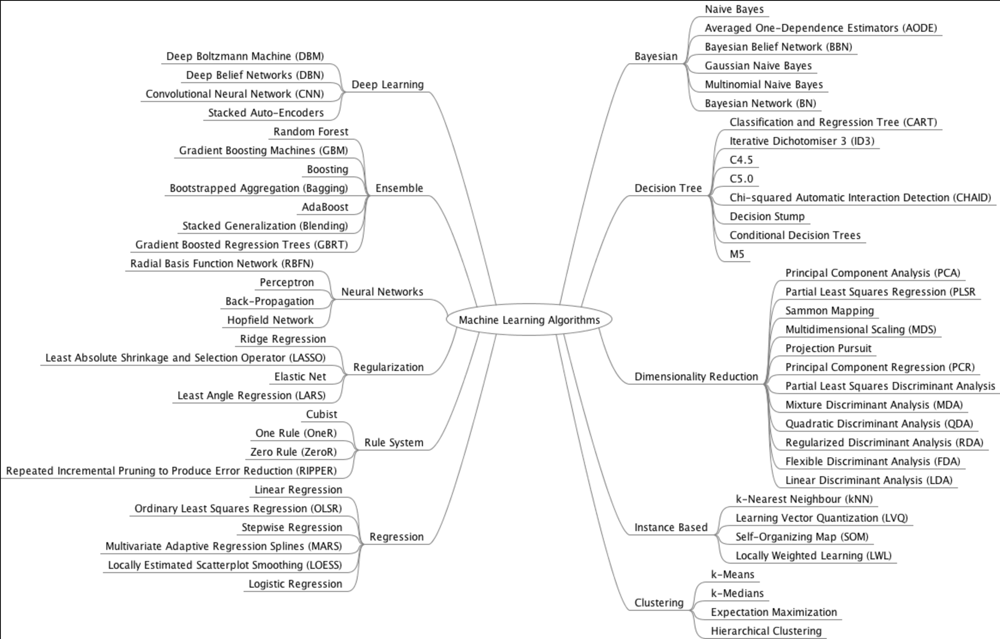

## A Tour of Machine Learning Algorithms

>  本文是原文的简略版笔记，英文原版[在此](http://machinelearningmastery.com/a-tour-of-machine-learning-algorithms/)

可以从两种维度来考虑和分类可能遇到的算法

1. 根据学习方式来分类
2. 根据形式和功能上的相似性来分类

### 根据学习方式分类

根据算法与经验和环境等等输入数据的交互的不同，一个算法可以有很多种建模方式。通常情况下在一些机器学习和人工智能的教科书里会认为学习是说算法能自己适应。目前仅有几种主流的学习方式和学习模型。这种算法组织方式很有用，因为这让你充分思考你问题的输入数据的角色，模型准备过程，然后选择最合适的方式来拿到最好的结果。

#### 有监督学习 Supervised Learning

输入数据为训练数据，有一个已知的标签或结果。用来做预测的模型是在训练过程中产生的，这个模型需要在预测错误的时候进行自我修正。模型在具有一定的准确性以后停止训练过程。

典型的应用场景是分类和回归。典型的算法包括逻辑回归和反向传播神经网路算法。

#### 无监督学习 Unsupervised Learning

输入数据没有标签和已知结果。模型在推断输入数据的结构时产生。这种方法使用数学方法系统的处理减少冗余，也可呢能根据相似性来组织数据。

典型的应用场景有聚类，降维，相关规则学习。典型的算法包括先验算法和k均值算法。

#### 半监督学习 Semi-Supervised Learning

输入数据是有标签和无标签样本的混合。有一种预测问题，模型必须学习数据的结构来组织数据并做出预测。

典型的应用场景是分类和回归。典型的算法是其他能对无标签数据做出假设的弹性方法的延伸。

### 根据相似性分类

我们经常根据算法的功能(怎么计算)将算法进行分类。比如说，基于树的算法和基于神经网络的算法。但是仍然有一些算法可以分到几个类目下，比如学习矢量量化（LVQ，Vector Quantization ）算法，既是神经网络算法也是基于实例的算法。也有一些名字相同的类目用于不同的场景比如回归和聚类。

#### 回归算法

回归关注变量之间关系的建模。通过模型提供预测错误的度量进行不断迭代重定义变量之间的关系来实现。回归广泛的应用于统计学，已经被并入统计机器学习。数据样本一般是一些离散的值，回归算法试着推测出这一系列连续值属性。主流的回归算法有：

-   普通最小二(OLSR, Ordinary Least Squares Regression)
-  线性回归 Linear Regression
-  逻辑回归 Logistic Regression
-  多元分析回归(逐步回归) Stepwise Regression
-  多元自适应回归样条 (MARS, Multivariate Adaptive Regression Splines)
-   本地散点平滑估计(LOESS, Locally Estimated Scatterplot Smoothing)

#### 基于实例的算法

基于实例学习解决的是决策问题。需要提供对于训练集来说重要的或者对模型来说必须的实例或者样本。这种算法一般会建立一个样本数据的数据库，将新数据与数据库中的数据对比衡量相似性找到最佳匹配做出预测。算法关注存储实例的展示和相似性衡量。主要有：

-  k邻近算法(kNN, k-Nearest Neighbor )
-  学习矢量量化(LVQ,  Learning Vector Quantization)
-  自组织映射模型 (SOM，Self-Organizing Map)
-  局部加权学习 (LWL， Locally Weighted Learning)

#### 正则化算法

